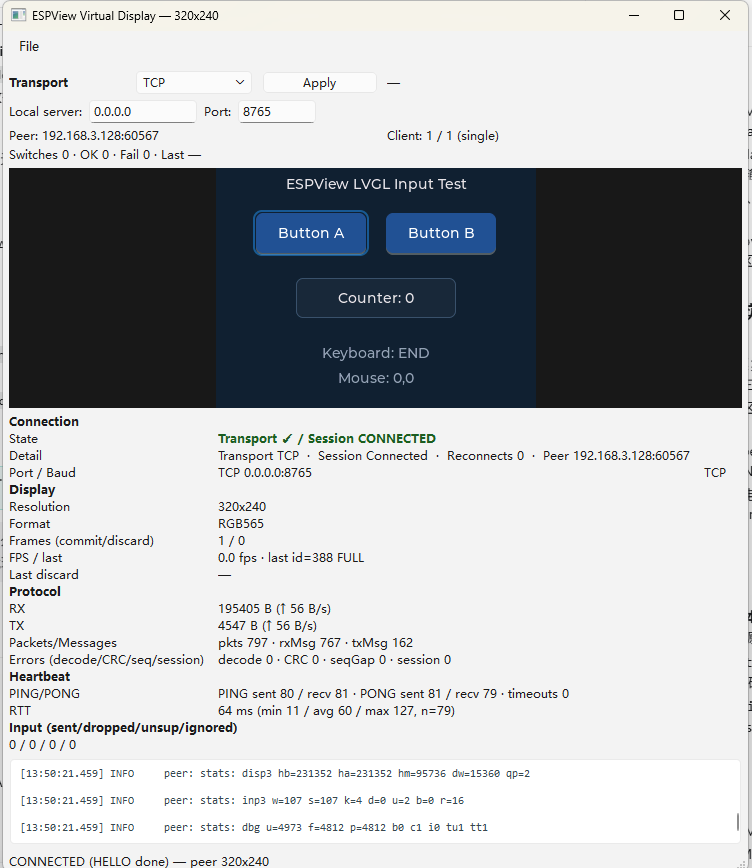
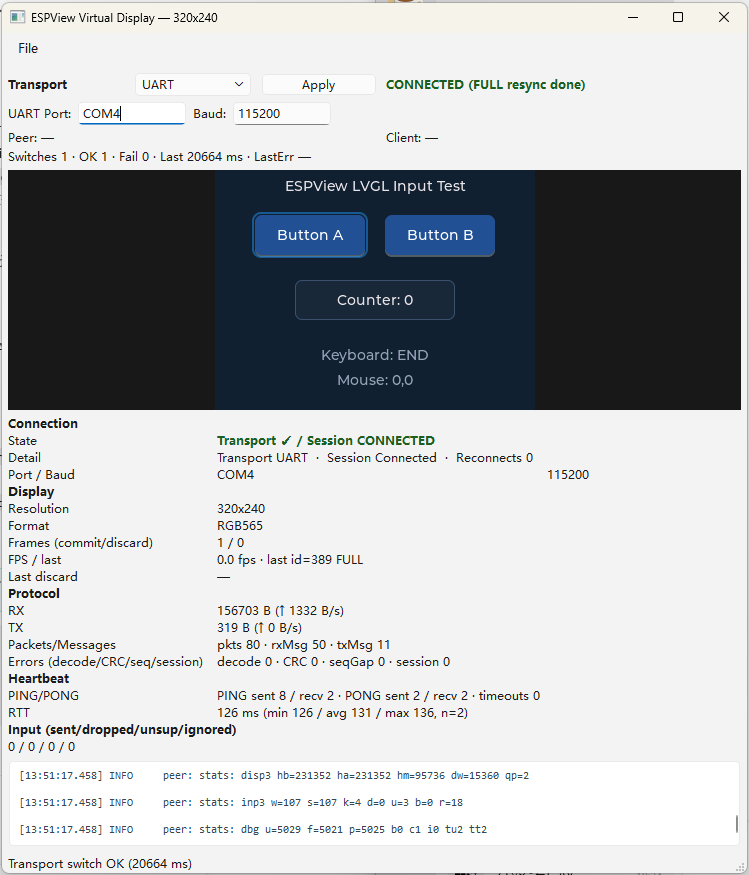
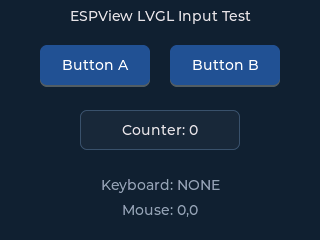
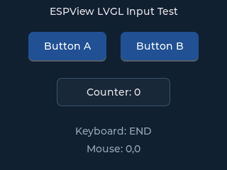
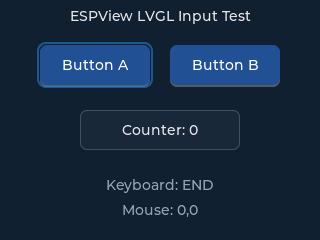

# ESPView -- ESP32 Virtual Display & Input Bridge

Phase-1 prototype (v0.1) -- milestones M0-M7-G (2026-08-16). The wire protocol is
frozen and covered by host suites plus real-hardware acceptance records; the full
specification and evidence live in [docs/DESIGN.md](docs/DESIGN.md) (written in
Simplified Chinese).

ESPView turns a PC into a *remote display and remote input device* for a real
ESP32. The ESP32 is always the single authority for display state and input
distribution: the LVGL UI running on the ESP32 is streamed through a small binary
protocol (Packet / Message / Frame layers) over UART or Wi-Fi TCP to a Qt
"Virtual Display" window on the PC; mouse and keyboard events captured on the PC
travel back over the reverse link and drive LVGL on the device.

## Contents

- [What is ESPView?](#what-is-espview)
- [Hardware requirements](#hardware-requirements)
- [Repository layout](#repository-layout)
- [Quick start: build, flash, run](#quick-start-build-flash-run)
- [UART or Wi-Fi?](#uart-or-wi-fi)
- [Configuring Wi-Fi (Wi-Fi Wizard)](#configuring-wi-fi-wi-fi-wizard)
- [The four display modes](#the-four-display-modes)
- [The OLED (optional physical preview)](#the-oled-optional-physical-preview)
- [Verification and testing](#verification-and-testing)
- [Screenshots](#screenshots)
- [FAQ](#faq)
- [Security and credential policy](#security-and-credential-policy)
- [Known limitations](#known-limitations)
- [Documentation index](#documentation-index)
- [Project status and roadmap](#project-status-and-roadmap)
- [License](#license)
- [Contributing](#contributing)

## What is ESPView?

- **Display authority.** LVGL owns the canonical frame. The `RemoteDisplay`
  dirty-rect path (`writeRect`) feeds the protocol encoder, which streams
  `FRAME_BEGIN` -> 1..N `FRAME_RECT` -> `FRAME_END` messages over the transport.
  The PC keeps only the last committed frame -- ESPView never holds a second
  full framebuffer on the ESP32.
- **Two transports.** UART (115200 8N1 -- the formal baseline) and Wi-Fi STA +
  TCP (PC = server `0.0.0.0:8765`, ESP32 = client). See
  [UART or Wi-Fi?](#uart-or-wi-fi) for their current status.
- **Reliability.** Fixed 20-byte packet header, IEEE CRC-32 with all parameters
  pinned, message-level CHUNKED reassembly, separate SEQ/frameId counters, a UART
  resync state machine, bounded TX queue with whole-frame drop, and forced FULL
  resync after every connect / reconnect / transport switch. ACK is used for
  control messages only.
- **Input reverse link.** Qt mouse/keyboard -> `INPUT_KEY` / `INPUT_MOUSE` ->
  ESP32 `InputManager` -> LVGL input adapter (HID keymap + coordinate mapping +
  wheel/click-hold semantics).
- **Observability.** The ESP32 emits `trx`, `mem`, and `oled` diagnostic lines
  over the ERROR text channel (non-wire format) roughly every 3 s, including
  RSSI/channel/reconnect counters, heap, and session error counters
  (decoder/CRC/seq-gap).
- **Four display modes.** VirtualOnly / PhysicalOnly / Mirror / Split, selectable
  at runtime from the Qt UI (`SET_MODE`) with the boot default compile-time
  configurable. An optional SSD1306 OLED provides a physical preview.
- **Wi-Fi provisioning.** A PC-side Wi-Fi Wizard bootstraps over UART: scan,
  select SSID, enter the password, configure the PC TCP server, and watch the
  ESP32 connect -- credentials stay in RAM only.

### Protocol in one paragraph

A packet is a fixed 20-byte header plus a payload of at most
`MAX_PACKET_PAYLOAD = 4096` bytes; CRC-32 (IEEE/zlib, poly `0xEDB88320`, init/final
`0xFFFFFFFF`, reflected, little-endian) covers `header[0..14)` + payload. A
message is 1..N packets -- large messages (such as `FRAME_RECT`) are split on
4096-byte boundaries with the CHUNKED flag cleared on the last packet. A frame is
`FRAME_BEGIN` (geometry / pixel format / frame id) -> `FRAME_RECT` (dirty rect +
pixels) -> `FRAME_END` (commit). PARTIAL frames apply only onto the last committed
FULL frame; without a committed base the receiver keeps waiting for a FULL.
Details and the frozen message table are in [docs/DESIGN.md](docs/DESIGN.md)
(section E).

## Hardware requirements

- **ESP32 (classic).** Verified on an ESP32-D0WDQ6 (rev v1.1) board. The board
  must expose a UART for the baseline link.
- **USB-UART bridge (CH340, verified).** Baseline is 115200 8N1. The reference
  board has an onboard CH340; the M7-E/F hardware experiments used an external
  USB-serial CH340 adapter. See
  [Why is my USB-UART (CH340) dropping?](#why-is-my-usb-uart-ch340-dropping)
  for known board-level stability notes.
- **Flash.** 4 MiB, custom partition table with a single 2 MiB factory app, no
  OTA (see `esp32/partitions.csv`).
- **Optional -- 128x64 I2C OLED (SSD1306/SH1106).** SDA -> GPIO21, SCL -> GPIO22,
  VCC -> 3.3 V, GND -> GND; 400 kHz I2C with internal pull-ups; address
  auto-detected over 0x08..0x77 (preferring 0x3C/0x3D; measured 0x3C).
- **Optional -- 2.4 GHz Wi-Fi** for TCP mode. The PC must be reachable on the LAN.
- **Host PC.** Windows + MSYS2 MinGW64 (g++, CMake, ctest) + Qt 6 for the GUI;
  ESP-IDF v6.0.2 for the firmware; Python 3.10 + pyserial for the hardware
  tooling (optional).

See [docs/hardware.md](docs/hardware.md) for the detailed list.

## Repository layout

```
shared/     # Platform-neutral core: protocol (Packet/Message/Encoder/Decoder/
            #   FrameAssembler/ProtocolEndpoint/RuntimeStats), transport
            #   (TransportManager/TransportSink), display (RemoteDisplay/
            #   DisplayRouter/modes), input (InputManager/keymap), oled, wifi
pc/         # Qt GUI (espview_virtual_display), SerialTransport/HostTcpTransport,
            #   host tools (com3_frame_test / tcp_transport_test /
            #   transport_config_test)
esp32/      # ESP-IDF v6.0.2: main + components (espview, lvgl_port, display,
            #   input, oled, testpattern), Kconfig, sdkconfig.defaults
            #   (production defaults, no credentials), partitions.csv
scripts/    # verify_host / verify_qt / verify_lvgl, build/flash workflow
            #   (espview_build*.bat, espview_flash.bat), hardware probes
docs/       # DESIGN.md (protocol spec + milestone evidence), per-topic guides
```

## Quick start: build, flash, run

### Prerequisites

- ESP-IDF v6.0.2 PowerShell profile
  (default `C:\Espressif\tools\Microsoft.v6.0.2.PowerShell_profile.ps1`,
  override with `ESPIDF_PROFILE`).
- MSYS2 MinGW64 with `g++`, `cmake`, `ctest` (default
  `C:\msys64\mingw64\bin`, override with `MINGW64_BIN`).
- Qt 6 (MSYS2 MinGW64 package) for the PC GUI.

The one-command entry points are documented in
[scripts/README.md](scripts/README.md); the raw `idf.py` flow is shown below.

### 1. Build the ESP32 firmware

```powershell
scripts\espview_build.bat -esp32          # builds esp32\build\uart_hw by default
```

Manual equivalent (same result):

```powershell
. 'C:\Espressif\tools\Microsoft.v6.0.2.PowerShell_profile.ps1'
cd esp32
idf.py -B build\uart_hw build
```

Default firmware behavior comes from `esp32/sdkconfig.defaults` (committed, no
credentials): UART transport @ 115200, LVGL demo app, console off, 4 MiB flash
custom partitions, PM enabled, test hooks off.

### 2. Configure (only when you need Wi-Fi / a different mode)

```powershell
idf.py -B build\uart_hw menuconfig
# ESPView -> Protocol transport -> Wi-Fi STA + TCP
# ESPView -> Wi-Fi SSID = <your-wifi-ssid>
# ESPView -> Wi-Fi password = <your-wifi-password>
# ESPView -> PC TCP server IPv4 = <pc-server-ip>    (port 8765)
# ESPView Display Routing -> Default DisplayRouteMode (0..3)
# OLED Display -> Enable OLED display (SSD1306 physical sink, default n)
```

Wi-Fi credentials live only in the local, git-untracked `esp32/sdkconfig` -- never
in source, defaults, docs, or logs (see
[Security and credential policy](#security-and-credential-policy)).

### 3. Flash

```powershell
scripts\espview_flash.bat -p COM4          # default port COM4, profile uart_hw
scripts\espview_flash.bat -p COM4 --no-reset
scripts\espview_flash.bat --dry-run        # validate args + files, do not flash
```

Or directly: `idf.py -p COM4 flash monitor`. Profiles (`-b uart_hw`, ...) are
isolated build directories, each with its own `build\<profile>\sdkconfig` (M7-F
F4); new profiles are created with `idf.py -B build\<name>` and need no script
changes.

### 4. Build and run the PC app

```powershell
scripts\verify_qt.bat
# -> build\verify_qt\espview_virtual_display.exe

build\verify_qt\espview_virtual_display.exe --transport uart --port COM4 --baud 115200
build\verify_qt\espview_virtual_display.exe --transport tcp --tcp-bind 0.0.0.0 --tcp-port 8765
```

CLI options (see `espview_virtual_display.exe --help`):

| Option | Meaning |
| --- | --- |
| `--transport uart\|tcp` | Transport type (default: QSettings, else `tcp`) |
| `--port <COM>` | COM port (UART; default QSettings, else `COM4`) |
| `--baud <n>` | UART baud rate (default `115200`) |
| `--tcp-bind <ip>` | TCP server bind address (default `0.0.0.0`) |
| `--tcp-port <n>` | TCP server port (default `8765`) |
| `--dump-png <dir>` | Debug: save each new FULL frame to `<dir>/full_<frameId>.png` |
| `--diag-log <file>` | Debug: append peer/session diagnostic lines to a file |
| `--autoclose-ms <n>` | Debug: auto-close the window after N ms (clean-exit test) |
| `--no-reset` | Skip the UART DTR/RTS reset pulse (test-only) |

### 5. One-command build + flash

```powershell
scripts\espview_build_flash.bat -esp32 -p COM4
```

## UART or Wi-Fi?

Both transports share the same protocol and frame semantics; they differ in
throughput and in how much hardware risk they carry today.

| | UART | Wi-Fi + TCP |
| --- | --- | --- |
| Status | **Formal, reliable baseline** | Working and faster, but the experimental / hardware-limited path |
| Link | USB-UART (CH340), 115200 8N1 | ESP32 STA client <-> PC TCP server (port 8765) |
| FULL frame (320x240 RGB565, 153600 B payload) | ~ **13.5 s** (~ 11.1 KB/s effective) | Measured ~0.2-0.7 s on the dev LAN (default Wi-Fi power save) |
| Provisioning | Out of the box | Requires the Wi-Fi Wizard over UART first |
| Known instability | None recorded at 115200 on the reference board | RF power-on is strongly correlated with USB-UART/board-level instability on the M7-E/F test rig (high-confidence hypothesis -- see FAQ) |
| Limits | Slow FULL frames | Single-client server; AP-outage scenario not hardware-validated; no TLS |

**Recommendation:** use UART 115200 for acceptance and day-to-day work; use
Wi-Fi/TCP when you need frame throughput and your board + USB supply chain
proves stable in the RF power-on tests. The protocol is identical, so switching
is a configuration choice, not a fork.

## Configuring Wi-Fi (Wi-Fi Wizard)

The Qt app includes a provisioning wizard that bootstraps **over UART** (the
credential path is UART-only):

1. **Init** -- explainer; connect the ESP32 over USB-UART.
2. **Connect + capabilities** -- the app connects and reads the device
   capabilities.
3. **Scan** -- `WIFI_SCAN_REQ` -> scan result list (OLED refresh is suspended
   during the scan by default).
4. **Select SSID, enter password** (empty = open network).
5. **Configure TCP server** -- the PC IP (`<pc-server-ip>`) and port (8765).
6. **Apply** -- `WIFI_CONFIG` (ACK) -> ESP32 Wi-Fi connect -> `WIFI_STATUS` phases
   (connecting -> GOT_IP -> TCP connected) -> first FULL frame -> **Done**.

Errors go through explicit retry/cancel paths; if the UART link drops, the UI
shows *"UART bootstrap unavailable"* rather than pretending the password was
wrong. Credentials entered in the wizard are kept in RAM only and erased after a
successful apply (see [docs/wifi.md](docs/wifi.md) and
[Security and credential policy](#security-and-credential-policy)).

## The four display modes

Mode semantics are frozen (wire: `SET_MODE` 0..3, additive):

| Mode | Qt Virtual Display | OLED | Purpose |
| --- | --- | --- | --- |
| **VirtualOnly (0)** | Application (LVGL frame) | Diagnostics (system status page) | Default; PC-only |
| **PhysicalOnly (1)** | Disabled | Application (LVGL thumbnail) | OLED-only |
| **Mirror (2)** | Application | Application | Same logical frame on both (no pixel-perfect requirement) |
| **Split (3)** | Application | Diagnostics | Qt app + OLED diagnostics simultaneously |

The OLED's physical scene is derived from the mode (Application for
Mirror/PhysicalOnly, Diagnostics for VirtualOnly/Split) so the two cannot
contradict. The boot-time default is compile-time configurable
(`CONFIG_ESPVIEW_DEFAULT_MODE`, default 0); at runtime the Qt mode dropdown
sends `SET_MODE` (ACK_REQ) and a FULL resync follows. In v0.1 the OLED sink is
optional (`CONFIG_ESPVIEW_OLED_ENABLE`, default n); without it, modes that
require a physical sink are rejected gracefully. See
[docs/display-modes.md](docs/display-modes.md).

## The OLED (optional physical preview)

- 128x64 I2C SSD1306/SH1106 (address auto-detected, measured 0x3C; SDA GPIO21 /
  SCL GPIO22, 400 kHz, refresh period configurable, default 500 ms).
- Two roles: a **diagnostics/status page** (transport/session/IP/RSSI/frame and
  error counters/heap/uptime) and a **physical preview** of the LVGL application
  frame in PhysicalOnly/Mirror modes (128x64 mono rendering, ~2 Hz preview
  updates; the PC also shows the same preview panel).
- **Scan suspend:** during Wi-Fi scans the OLED refresh is suspended by default
  (`CONFIG_ESPVIEW_SCAN_SUSPEND_OLED=y`) and restored by the scan transaction's
  terminal path (success/failure/timeout/disconnect).
- The OLED is **never** the authoritative framebuffer -- the LVGL frame on the
  ESP32 is.

See [docs/oled.md](docs/oled.md).

## Verification and testing

| Entry | What it runs | Last measured (2026-08-16, HEAD `c48efcd`) |
| --- | --- | --- |
| `scripts\verify_host.bat` | Protocol host suite + ctest + `transport_config_test` + `com3_frame_test --selftest-queue` + TCP loopback (127.0.0.1, no hardware) | **384,848 checks / 0 failures** (protocol 384,433; scan transaction 192; transport config 97; TCP loopback 126); ctest 2/2 passed |
| `scripts\verify_qt.bat` | Qt GUI target build (`espview_virtual_display.exe`) | ALL PASS |
| `scripts\verify_lvgl.bat` | Host tests + ctest + ESP32 build via `idf.py` (+ optional COM sanity when `ESPVIEW_COM3` is set) | ALL PASS |
| Hardware manual | 30-min TCP long-run, TCP reconnect stress 10/10, UART<->TCP runtime switch 20x20, PARTIAL/input chains | Recorded in [docs/DESIGN.md](docs/DESIGN.md) (V.7/V.9/W.6/X.10) |

The 30-minute long-run is a manual verification and is intentionally not part of
the fast/offline CI. Hardware experiments (OLED A/B/C during Wi-Fi scans) run via
`scripts\espview_e_ab_harness.py`; see [scripts/README.md](scripts/README.md).
See [docs/testing.md](docs/testing.md) for the full matrix.

## Screenshots

PC GUI (`espview_virtual_display.exe`): VirtualScreen on the left (320x240,
letterboxed), status panel below with transport, connection state, and
frame/input statistics.

| Mode | Screenshot |
| --- | --- |
| TCP mode (PC = server `0.0.0.0:8765`, ESP32 = client, connected) |  |
| UART mode (COM / 115200) |  |

Real-hardware acceptance captures (LVGL demo rendered on the ESP32 and streamed
to the PC; `--dump-png` saves each new FULL commit as 320x240 RGB565):

| Scenario | Screenshot |
| --- | --- |
| Hardware sanity (first FULL commit, frame id=1) |  |
| 30-min TCP long-run (frame id=63, no reconnect jitter) |  |
| TCP reconnect stress round 1 (10/10 OK, FULL resync after reconnect) |  |

## FAQ

### What does 115200 mean?
UART 8N1 at 115200 bits/s -- the formal baseline of the project. It is the
reliable rate used for all hardware acceptance (~ 11.1 KB/s effective payload
throughput). 921600 exists as an experimental option but is not reliable for
large-frame bursts and is not the baseline.

### Why is a FULL frame slow on UART?
A FULL frame is 320x240x2 = 153600 payload bytes; at 115200 baud that is ~13.5 s
end-to-end. This is a real, measured limit, which is why the design targets
dirty-rect **PARTIAL** updates (small rects -> well under 5% link load) and only
uses FULL for handshake/resync/large changes. TCP is much faster (~0.2-0.7 s on
the dev LAN).

### Why is my Wi-Fi scan failing?
On the M7-E/F test rig, Wi-Fi RF power-on (scan/start) is strongly correlated
with USB-UART/board-level instability: the serial link can drop for ~0.5-1.5 s
and the ESP32 occasionally hangs until a manual reset. The physical mechanism is
a **high-confidence hypothesis, not a confirmed root cause** -- power margin,
EMI coupling, CH340 driver behavior, and USB transients all await dedicated
hardware verification (voltage/current capture). It is **not confirmed** that
the supply is insufficient. Firmware mitigations shipped: fixed 80 MHz PM,
OLED suspend during scans, and explicit *"UART bootstrap unavailable"* error
surfacing. The repeatable A/B/C harness is `scripts\espview_e_ab_harness.py`
(see [docs/troubleshooting.md](docs/troubleshooting.md)).

### Why is my USB-UART (CH340) dropping?
Same finding as above: RF power-on and USB-UART/board-level instability are
strongly correlated on the test rig; the physical mechanism remains a
high-confidence hypothesis (power margin / EMI / USB transient) pending
hardware verification. The UART baseline itself (no RF activity) records no
dropouts on the reference board.

### Can multiple clients connect?
No. The PC TCP server accepts one client at a time (`Client: 1 / 1 (single)`);
multi-device concurrency is out of scope.

### Why 4 MiB flash and no OTA?
The project targets a 4 MiB flash with a custom partition table: a single 2 MiB
factory app, no OTA partition. Firmware measured ~1.01 MiB (0x1037F0) at M6-B,
leaving ~49% headroom. TinyUSB/OTA/UDP/mDNS/WebSocket/HTTP/TLS/cloud are
explicitly out of scope.

### Where is the protocol / architecture documentation?
[docs/DESIGN.md](docs/DESIGN.md) (frozen protocol spec + milestone evidence,
Chinese) and [docs/architecture-overview.md](docs/architecture-overview.md)
(planned overview).

### How do I contribute?
See [docs/contributing.md](docs/contributing.md) and
[docs/development.md](docs/development.md). Key rules: never commit
`esp32/sdkconfig*` (may contain credentials), keep credentials out of code/docs,
run `scripts\verify_host.bat` before opening a change, and keep Markdown files
LF-ended.

## Security and credential policy

- **RAM-only credentials.** On the ESP32, provisioned SSID/password live in RAM
  and are cleared on apply/reboot (`CLEAR` wipes them and disconnects). No
  NVS/at-rest persistence is implemented in this phase.
- **Never persisted or logged.** The password never appears in logs, the ERROR
  text channel, RuntimeStats, QSettings, git, docs, PNG dumps, or the UI (only
  its length may be recorded).
- **QSettings whitelist.** The PC persists only a small allow-list
  (`transport/type`, `uart/port`, `uart/baud`, `tcp/port`, `window/size`,
  physical-preview toggle); `TransportConfig` has no credential fields, so the
  whitelist structurally cannot save a password.
- **Commit hygiene.** `esp32/sdkconfig` and `esp32/sdkconfig.*` are git-ignored
  (`sdkconfig.defaults` is committed and credential-free). Check `git status`
  before committing.
- **Plaintext caveat.** Provisioning payloads are plaintext over UART (CRC-32
  integrity, not encryption); there is no TLS. Threat model = trusted
  development LAN; disconnect the UART after provisioning and bind the PC TCP
  server to `127.0.0.1` where possible (see DESIGN section AF.4).

See [docs/security.md](docs/security.md).

## Known limitations

- No native USB device support (ESP32 USB OTG not used).
- UART baseline is 115200 8N1; 921600 is experimental-only (unreliable for
  large-frame bursts).
- UART FULL frame ~13.5 s -- the design assumes dirty-rect PARTIAL updates.
- PC TCP server is single-client.
- 4 MiB flash, single 2 MiB factory app, no OTA.
- AP outage (router power loss) is deferred and not fully hardware-validated;
  validated: TCP disconnect, backoff reconnect, PC restart, FULL resync.
- External CH340 + RF power-on boot instability on the test rig -- strongly
  correlated, physical mechanism a high-confidence hypothesis, hardware
  verification pending (power margin / EMI / USB transient).
- No physical LCD/touch; HardwareDisplay/MirrorDisplay real-machine verification
  is pending (abstraction + wire support are present).
- No TLS, no NVS credential persistence, no UDP/mDNS/WebSocket/HTTP/cloud, no
  multi-device concurrency.

## Documentation index

| Doc | Content |
| --- | --- |
| [docs/DESIGN.md](docs/DESIGN.md) | Frozen protocol spec + milestone evidence (Chinese) |
| [docs/architecture-overview.md](docs/architecture-overview.md) | System architecture at a glance |
| [docs/getting-started.md](docs/getting-started.md) | First steps end-to-end |
| [docs/hardware.md](docs/hardware.md) | Hardware requirements and wiring |
| [docs/uart.md](docs/uart.md) | UART transport, baud rates, troubleshooting |
| [docs/wifi.md](docs/wifi.md) | Wi-Fi/TCP transport and provisioning |
| [docs/display-modes.md](docs/display-modes.md) | The four display modes |
| [docs/oled.md](docs/oled.md) | OLED diagnostics + physical preview |
| [docs/input.md](docs/input.md) | Input reverse link (mouse/keyboard) |
| [docs/troubleshooting.md](docs/troubleshooting.md) | Common problems and fixes |
| [docs/testing.md](docs/testing.md) | Verification matrix and CI behavior |
| [docs/development.md](docs/development.md) | Build/development workflow |
| [docs/contributing.md](docs/contributing.md) | Contribution guidelines |
| [docs/security.md](docs/security.md) | Credential policy and threat model |
| [docs/changelog.md](docs/changelog.md) | Release notes per milestone |
| [docs/faq.md](docs/faq.md) | Frequently asked questions |
| [scripts/README.md](scripts/README.md) | Build/flash scripts reference |

## Project status and roadmap

**Status (honest):** Phase-1 v0.1 prototype. Milestones M0-M7-F are committed
(HEAD `c48efcd`); the M7-G documentation milestone (this README + the per-topic
docs above) is in progress. The wire protocol has been frozen since M1-3C --
subsequent milestones only add capabilities without changing existing messages.

- M0 -- protocol core (Packet/Message/Frame, CRC-32, streaming encoder)
- M1-1/2 -- UART transport, firmware + flash
- M1-3A-D -- protocol finish, streaming API, docs, host-test CI
- M2 -- Qt Virtual Display (SerialWorker -> FrameAssembler -> widget)
- M3 -- input reverse link (INPUT_KEY / INPUT_MOUSE)
- M4 -- frame pipeline + runtime stats
- M5-A/B -- LVGL display backend + input adapter
- M6-A-E -- Wi-Fi/TCP, performance, runtime transport switch UI, config
  persistence, production profile, 30-min long-run
- M7-A/B -- independent OLED diagnostics + production semantics
- M7-C1-C4 -- multi-display abstraction, physical sink, four-mode Qt UI
- M7-D1-D6 -- CAPABILITIES, PHYSICAL_PREVIEW, Wi-Fi provisioning, wizard,
  build/flash UX, UART acceptance + power mitigations
- M7-E -- power-aware provisioning (A/B/C experiments, OLED scan-suspend)
- M7-F -- hardware path diagnosis + tooling hardening
- M7-G -- documentation refresh (in progress)

**Roadmap (not yet implemented):** hardware verification of the RF/USB power
hypothesis (voltage/current capture), AP-outage testing, and -- explicitly out of
scope for this phase -- NVS persistence, TLS, OTA, and multi-client support.

## License

Apache License 2.0 -- see [LICENSE](LICENSE).

## Contributing

See [docs/contributing.md](docs/contributing.md) and
[docs/development.md](docs/development.md). In short: keep credentials out of
any commit, run `scripts\verify_host.bat` before opening a change, and prefer
small focused milestones.